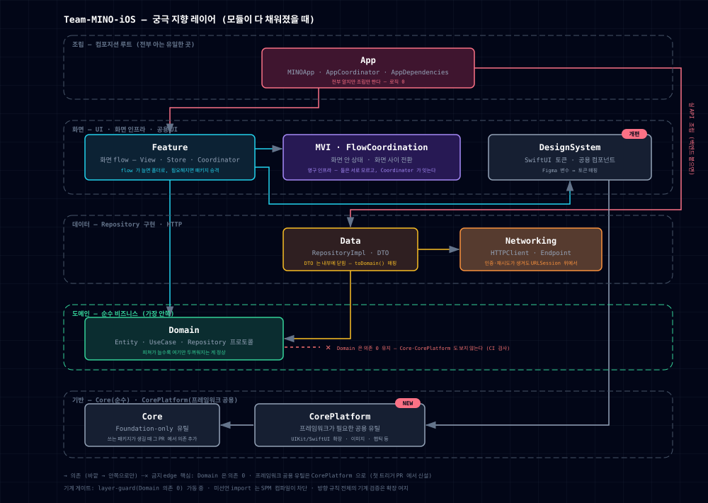

# Team-MINO-iOS

Mash-Up MINO 팀의 iOS 앱입니다. SwiftUI 위에 **Clean Architecture** 구조로 만들고, 화면 아키텍처는 **MVI**를 씁니다. 모듈은 레이어 단위로 SPM 패키지를 나눠서 구성합니다. 외부 라이브러리 없이 애플 프레임워크만 쓰는 걸 기본 방향으로 합니다.

## 아키텍처 — 모듈 의존 그래프

의존성은 **바깥에서 안쪽으로만** 향합니다 (`Feature → Domain ← Data`). 가장 안쪽에 있는 Domain은 바깥을 모르고, Data가 거꾸로 Domain의 프로토콜에 의존합니다(의존성 역전).

  

> 인터랙티브 버전(PNG/PDF 내보내기): [docs/architecture.html](docs/architecture.html)

| 모듈 | 역할 | 의존 |
|---|---|---|
| `App` | 컴포지션 루트 — 구체 타입 조립은 여기서만 (`AppDependencies`, xcodeproj 타깃) | Feature · Data(실 API 연결 시) |
| `Feature` | 화면 flow — SwiftUI View · Store · Coordinator | Domain · MVI · FlowCoordination |
| `MVI` | 화면 상태 인프라 — `Effect` · `Store` + `TestStore` (Observation만 의존) | — |
| `FlowCoordination` | 화면 전환 인프라 — `Coordinator` · `FlowFinish` · `flowRoot` | — |
| `Domain` | Entity · UseCase · Repository 프로토콜 — 비즈니스 규칙 | **—** (의존 0) |
| `Data` | Repository 구현 · DTO (`toDomain()` 매핑, DTO는 내부에 닫힘) | Domain · Networking |
| `Networking` | `HTTPClient` · `Endpoint` | — |
| `DesignSystem` | 디자인 토큰 · 컴포넌트 (UIKit) | — |
| `Core` | 공용 유틸 | — |

### 앞으로의 구조

모듈이 다 채워졌을 때 지향하는 모습입니다. 프레임워크가 필요한 공용 유틸이 처음 생기면 `CorePlatform`을 신설하고, 백엔드가 붙으면 App이 실제 구현을 조립합니다. DesignSystem은 SwiftUI 토큰으로 개편해서 Feature가 씁니다.

  

## 화면 아키텍처

### MVI — 단방향 데이터 흐름

상태는 순수 `reduce` 함수가 만들고, 부수효과는 `Effect` 값으로 반환해서 `Store`가 실행합니다. 비동기 결과는 Response Action(`loaded`/`loadFailed`)으로 다시 돌아오고, 화면 전환은 `.navigate`로 Coordinator에 넘깁니다. `Store`는 Observation만 쓰고, Combine 대신 async/await 기반 스트림으로 비동기를 처리합니다.

  

### DI — 컴포지션 루트

전역 컨테이너 없이 생성자 주입만 씁니다. 각 Coordinator는 자기 의존만 담은 좁은 deps 프로토콜을 받고, `AppDependencies` 한 타입이 모든 deps 프로토콜을 준수합니다 — 주입을 빠뜨리면 런타임 크래시가 아니라 컴파일 에러로 바로 드러납니다.

  

## AI 활용

극한의 에이전틱 코딩을 위해 AI를 적극 활용합니다.

- **Figma → PR 워크플로우** — 피그마 URL 하나만 넣으면 화면 구현부터 테스트, QA까지 이어서 돌아가는 [Mino-harness](https://github.com/hooni0918/Mino-harness) 워크플로우를 씁니다. 사람이 하나씩 보는 대신, 피그마 원본과 다시 비교하고 빌드가 되는지 확인하는 식으로 자동 검증합니다.
- **팀 문서 · 공통 규칙** — [mino-Wiki](https://mino-qa.vercel.app/) 사이트에 RAG 챗봇이 있어서, 문서와 팀 공통 규칙을 바로 물어볼 수 있습니다.

## Contributors

<table>
  <tr align="center">
    <td><b>박병호</b></td>
    <td><b>김유빈</b></td>
    <td><b>이지훈</b></td>
  </tr>
  <tr align="center">
    <td>
       
      <a href="https://github.com/hoBahk"><i>hoBahk</i></a>
    </td>
    <td>
       
      <a href="https://github.com/dbqls200"><i>dbqls200</i></a>
    </td>
    <td>
       
      <a href="https://github.com/hooni0918"><i>hooni0918</i></a>
    </td>
  </tr>
</table>

---

  

