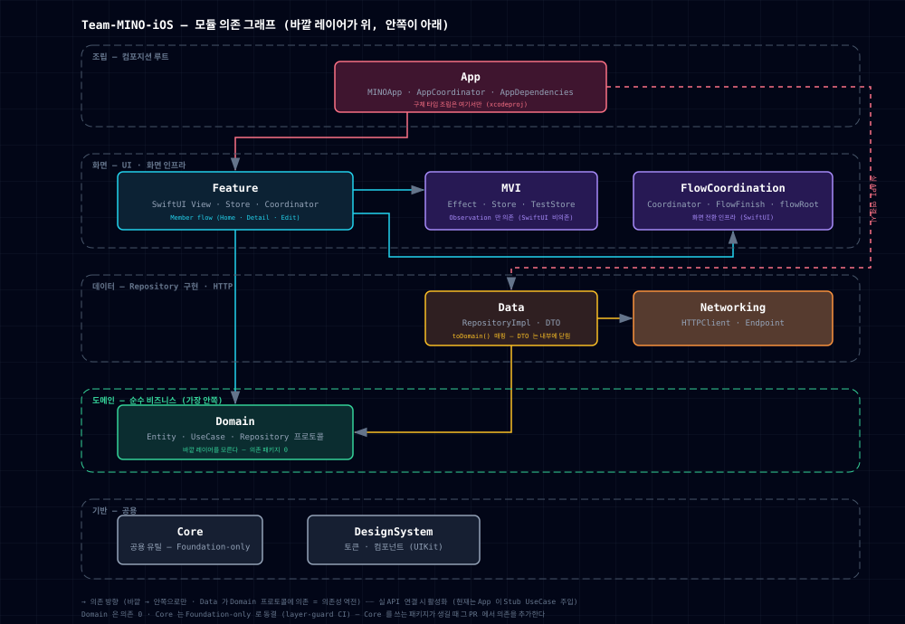
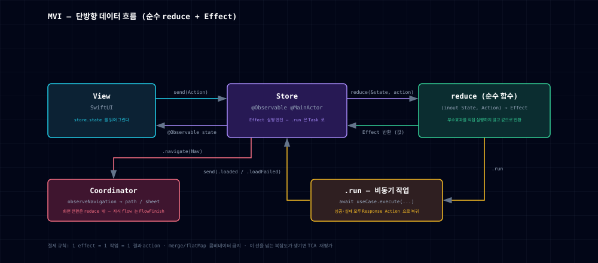
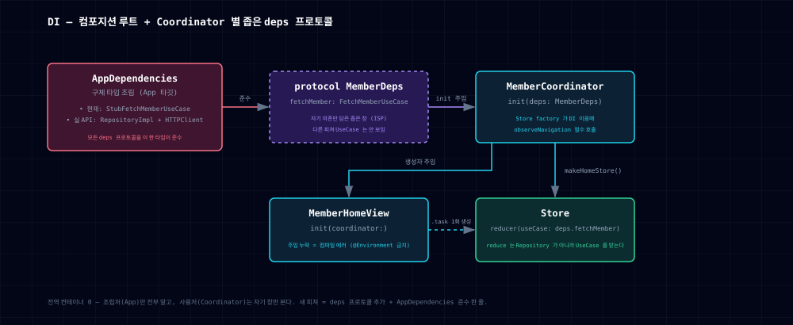

# Team-MINO-iOS

Mash-Up MINO 팀의 iOS 앱. SwiftUI 위에 **Clean Architecture + DDD**를 깔고, 화면 아키텍처는 **MVI + Coordinator + DI** 3축으로 구성한다. 모듈은 레이어 단위 로컬 SPM 패키지로 나뉜다.

## 아키텍처 — 모듈 의존 그래프

의존성은 **바깥에서 안쪽으로만** 향한다 (`Feature → Domain ← Data`). 가장 안쪽의 Domain은 바깥을 모르고, Data는 Domain의 프로토콜에 의존한다(의존성 역전).

<div align="center">
  
</div>

> 인터랙티브 버전(PNG/PDF 내보내기): [docs/architecture.html](docs/architecture.html)

| 모듈 | 역할 | 의존 |
|---|---|---|
| `App` | 컴포지션 루트 — 구체 타입 조립은 여기서만 (`AppDependencies`, xcodeproj 타깃) | Feature · Data(실 API 연결 시) |
| `Feature` | 화면 flow — SwiftUI View · Store · Coordinator | Domain · MVI · FlowCoordination |
| `MVI` | 화면 상태 인프라 — `Effect` · `Store` + `TestStore` (Observation만 의존) | — |
| `FlowCoordination` | 화면 전환 인프라 — `Coordinator` · `FlowFinish` · `flowRoot` | — |
| `Domain` | Entity · UseCase · Repository 프로토콜 — 비즈니스 규칙 | Core |
| `Data` | Repository 구현 · DTO (`toDomain()` 매핑, DTO는 내부에 닫힘) | Domain · Networking |
| `Networking` | `HTTPClient` · `Endpoint` | Core |
| `DesignSystem` | 디자인 토큰 · 컴포넌트 (UIKit) | Core |
| `Core` | 공용 유틸 | — |

## 화면 아키텍처

### MVI — 단방향 데이터 흐름

상태는 순수 `reduce` 함수가 만들고, 부수효과는 `Effect` 값으로 반환해 `Store`가 실행한다. 비동기 결과는 Response Action(`loaded`/`loadFailed`)으로 루프에 복귀하고, 화면 전환은 `.navigate`로 Coordinator에 위임된다.

<div align="center">
  
</div>

### DI — 컴포지션 루트

전역 컨테이너 없이 생성자 주입만 쓴다. 각 Coordinator는 자기 의존만 담은 좁은 deps 프로토콜을 받고, `AppDependencies` 한 타입이 모든 deps 프로토콜을 준수한다 — 주입 누락은 런타임 크래시가 아니라 컴파일 에러로 잡힌다.

<div align="center">
  
</div>

상세 규칙과 새 화면 작성법: [.claude/docs/mvi-coordinator-di.md](.claude/docs/mvi-coordinator-di.md) · 레이어 경계 규칙: [.claude/docs/clean-architecture.md](.claude/docs/clean-architecture.md)

## AI — 에이전틱 코딩

극한의 에이전틱 코딩을 위해 AI를 적극 활용한다.

- **QA 하네스** — [Mino-harness](https://github.com/hooni0918/Mino-harness): Figma URL 하나로 분류 → 기존 화면 수정 → 접근성 식별자 부여 → 테스트 작성 → 빌드 → 시뮬레이터 QA까지 무인으로 도는 파이프라인. 사람 리뷰 대신 기계 게이트(Figma 원본 대조·컴파일·식별자)가 각 단계를 검증하고, 신규 화면 구현은 대화형 워크플로우로 분리한다. 실험 기록은 [PR #29](https://github.com/mash-up-kr/Team-MINO-iOS/pull/29).
- **팀 문서 · 공통 규칙** — [mino-qa](https://github.com/hooni0918/mino-qa) 문서화 레포의 배포 사이트 **[mino-qa.vercel.app](https://mino-qa.vercel.app)** 에 RAG 챗봇이 있다. 문서화와 공통 내용은 여기를 참조한다.

## 빌드 / 테스트

```bash
# 앱 (전 레이어 통합 빌드)
open App/App.xcodeproj          # Xcode에서 App 스킴 실행
# 또는 CLI:
xcodebuild -project App/App.xcodeproj -scheme App \
  -destination 'platform=iOS Simulator,name=iPhone 16 Pro' build

# 패키지 단위 테스트 (호스트에서 실행 — macOS 타깃 포함 패키지)
cd Packages/Core             && swift test
cd Packages/Domain           && swift test
cd Packages/FlowCoordination && swift test   # FlowFinish
cd Packages/MVI              && swift test   # TestStore(L1~L3)
cd Packages/Feature          && swift test   # reducer L1~L3 + Coordinator

# UIKit/네트워킹 의존 패키지(Networking/Data/DesignSystem)는
# iOS 시뮬레이터에서 빌드/테스트한다 (macOS 호스트의 swift build 미지원)
```

> `App.xcodeproj`는 xcodegen으로 1회 부트스트랩 생성한 산출물이며, 이후 앱 타깃 설정은 Xcode에서 직접 관리한다.

## Contributors

<table>
  <tr align="center">
    <td><b>박병호</b></td>
    <td><b>김유빈</b></td>
    <td><b>이지훈</b></td>
  </tr>
  <tr align="center">
    <td>
      <br>
      <a href="https://github.com/hoBahk"><i>hoBahk</i></a>
    </td>
    <td>
      <br>
      <a href="https://github.com/dbqls200"><i>dbqls200</i></a>
    </td>
    <td>
      <br>
      <a href="https://github.com/hooni0918"><i>hooni0918</i></a>
    </td>
  </tr>
</table>

---

<div align="center">
  <a href="https://hits.sh/github.com/mash-up-kr/Team-MINO-iOS/">
    
  </a>
</div>
